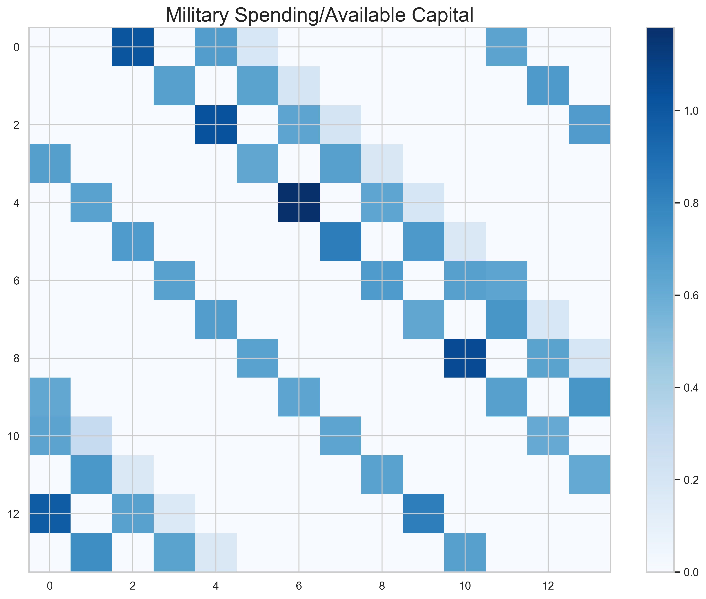
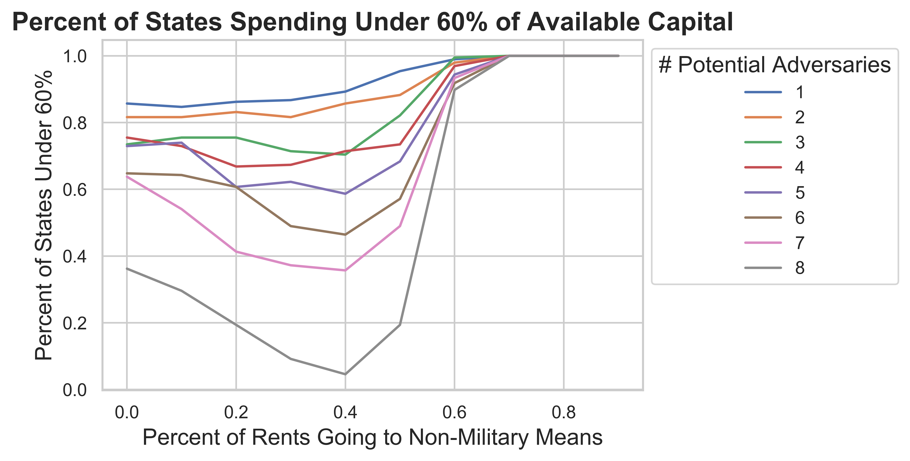

class: center, middle

<!-- For info on xaringan slides -->
<!-- https://github.com/yihui/xaringan -->
<!-- https://github.com/yihui/xaringan/wiki -->
<!-- https://github.com/svmiller/svm-r-markdown-templates/blob/master/svm-xaringan-example.Rmd -->
<!-- https://github.com/svmiller/svm-r-markdown-templates/blob/master/svm-xaringan-style.css -->
<!-- https://alison.rbind.io/post/r-ladies-slides/ -->

# Question

How do states lessen the severity of the security dilemma?

---

class: left, middle

# Security Dilemma 

+ The means by which a state makes itself more secure make others less secure.

+ Jervis (1978): 3520 citations according to Google Scholar

+ Glaser (1997): 615 citations

+ Etc. 

---


class: left, middle

# Spiral Model

+ Worst case scenario: reciprocal spirals of insecurity lead to war

+ Even if no war, economic costs (Fearon, 2018) and damage to trust (Kydd, 2007) are mutually undesirable


---

class: left, middle

# Sources of variation

+ Distinguishable intentions
    + Can defensive intentions be distinguished from offensive intentions?

+ Offense-Defense Balance
    + Do dominant military technologies favor offense or defense?

---

class: left, middle

# But...

+ Distinguishable intentions: 
    + Copeland: **Uncertainty of *future* intentions**
    + Fearon: **Incentives to misrepresent private information: *why not act defensive?* **
    + Snyder and Borghard: **Leaders prefer to not fully reveal intentions or tie their hands to one set path**

+ Offense-Defense Balance: 
    + Biddle: **Technological balance is murky, * capability employment* matters most**
    + Glaser and Kaufmann: **Incredibly hard to operationalize**

---

class: left, middle

# Puzzle

+ Theoretically, the problem appears inescapable

---

class: left, middle

# Puzzle 

+ But if we take a step back, then the problem appears overblown.

```{r echo = FALSE, message = FALSE, warning = FALSE, fig.width=20, fig.height = 10}
## libraries
library(dplyr)
library(ggplot2)
library(rio)
library(tikzDevice)
library(hrbrthemes)
library(magick)
library(showtext)
library(patchwork)

## data
econ_dat <- import("../data/real_dat.rds")

## useful manipulations
econ_dat$mil_gdp <- (econ_dat$milex/econ_dat$gdp) * 100 # percent
econ_dat$mil_govexp <- (econ_dat$milex/econ_dat$gov_exp) * 100

# Basic graph
p1 <- ggplot(
        data = econ_dat,
        aes(x = mil_gdp)
    ) + 
    geom_histogram() + 
    labs(
        title = 'Military Spending as a Percent of GDP',
        subtitle = '2016',
        x = 'Percent',
        y = 'Count',
        caption = 'Source: World Bank, SIPRI'
    )

# Adjust colors -- these are up to you
p1 <- p1 + 
    theme_ipsum() + # great minimalist theme
    theme(
        plot.title = element_text(color = '#000000', size = 22),
        plot.subtitle = element_text(color = '#000000', size = 20),
        plot.caption = element_text(color = '#000000', 
            face = 'bold', size = 20),
        axis.title.x = element_text(size = 20),
        axis.title.y = element_text(size = 20),
        axis.text.x = element_text(color = "black", size = 20),
        axis.text.y = element_text(color = "black", size = 20)
    )

p2 <- ggplot(
        data = econ_dat,
        aes(x = mil_govexp)
    ) + 
    geom_histogram() + 
    labs(
        title = 'Military Spending as a Percent of Government Expenditures', subtitle = '2016',
        x = 'Percent',
        y = 'Count',
        caption = 'Source: World Bank, SIPRI'
    )

# Adjust colors -- these are up to you
p2 <- p2 + 
    theme_ipsum() + # great minimalist theme
    theme(
        plot.title = element_text(color = '#000000', size = 22),
        plot.subtitle = element_text(color = '#000000', size = 20),
        plot.caption = element_text(color = '#000000', 
            face = 'bold', size = 20),
        axis.title.x = element_text(size = 20),
        axis.title.y = element_text(size = 20),
        axis.text.x = element_text(color = "black", size = 22),
        axis.text.y = element_text(color = "black", size = 20)
    )

p1 + p2
```

---

class: left, middle

# Puzzle

+ Even in rivalries where an issue is under dispute, it is not clear if a spiral is present. Equally as plausible, one state may be just keeping up and attempting to deter the larger state.


---

class: left, middle

# Puzzle

+ So what gives? Why this gap between theory and reality?

---

class: left, middle


# Argument


**For almost all states, the security dilemma is largely irrelevant. Military parity with leading powers is *economically infeasible*.**


Often, the only way to win is not to play.

---

class: left, middle

# Why a computational model? 

+ Most important variable is not observable in reality: percent of *available* capital to military. 
    + The state cannot access all GDP and current national expenditures could be larger.

+ Easily links domestic explanations of foreign policy (e.g. Weeks (2014), Milner and Tingley (2015)) and systemic/structural approaches (e.g. Braumoeller (2013), Waltz (1979)) 

+ Speaks to formal literature of political economy of national security (e.g. Fearon (2018), Poast (2019))

---

class: left, middle


# Model

+ Computational model of state growth and military spending in an n-player system.

+ Setup:
    + 14x14 grid
    + One agent (state) per cell
    + Parameters:
        + GDP
        + Growth 
        + Max extractable capital
        + Domestic needs
        + Military size

---
class: left, middle

# Model

+ Decision rule:
    1. Record each neighbor's military size
    2. Assess the difference between the size of each neighbor's military and one's own 
    3. Calculate available capital
        + (GDP * extractable capital) - domestic needs
    4. Consider $n$ largest neighbors for balancing
        + $n$ can be varied from 1 to 8
    5. Balance against the largest neighbor possible
    6. If each of $n$ largest neighbors is too large to balance against, then save capital
    7. Military spending is removed from GDP 

---

class: center, middle

# Starting conditions: GDP


---

class: center, middle

# Starting conditions: Military


---

class: center, middle

# 100 Iterations: Military


---

class: center, middle

# 100 Iterations: Military/Available Capital




---

class: center, middle

# 1000 Iterations: Military


---

class: center, middle

# 1000 Iterations: Military/Available Capital


---

class: left, middle

# Parameter sweep

+ Vary: 
    1. $n$ most powerful neighbors to consider for balancing
    2. Percent of available capital that must go to domestic spending first

---

class: left, middle

# Parameter sweep 

## Under 20% of available capital to military

<div align = "center">


</div>

---

class: left, middle

# Parameter sweep

## Under 40% of available capital to military

<div align = "center">


</div>

---

class: left, middle

# Parameter sweep

## Under 60% of available capital to military

<div align = "center">



</div>

---

class: left, middle

# Concluding points 

+ By varying state size and including a simple-guns butter tradeoff, only under the most extreme circumstances do most states spend the majority of available capital on the military.

+ How to best externally validate? 

+ Literatures this speaks to:
    + Hierarchy: *Why are states willing to cede autonomy to a hierarch?* 
    + Nuclear weapons: *Why risk going nuclear?*
    + Spiral vs. Deterrence Model: *Contradictory prescriptions and explanations, which fits best?*

---

class: center, middle

# Thanks! 

kent.249@osu.edu

dnkent.github.io